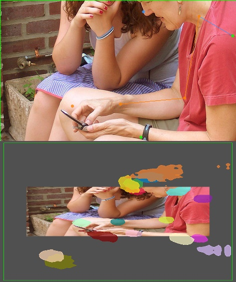
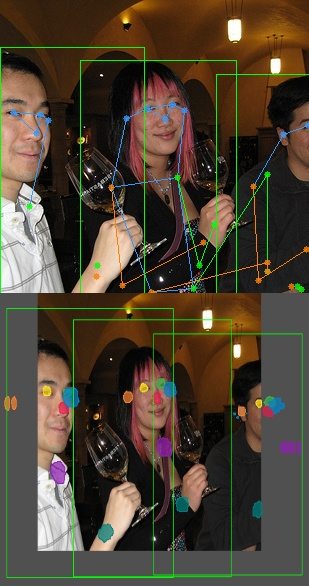

# ProbPose: A Probabilistic Approach to 2D Human Pose Estimation

<div align="center">


[](https://arxiv.org/abs/2412.02254) &nbsp;&nbsp;&nbsp;
[](https://mirapurkrabek.github.io/ProbPose/) &nbsp;&nbsp;&nbsp;
[](LICENSE)

</div>

## 📋 Overview

ProbPose introduces a probabilistic framework for human pose estimation, focusing on reducing false positives by predicting keypoint presence probabilities and handling out-of-image keypoints. It also introduces the new Ex-OKS metric to evaluate models on false positive predictions.

Key contributions:
- **Presence probability** concept that distinguishes keypoint presence from confidence
- **ProbPose**: top-down model for out-of-image keypoints estimation
- **OKSLoss adapted for dense predictions** in risk minimization formulation
- **Ex-OKS evaluation metric** penalizing false positive keypoints
- **CropCOCO dataset** for out-of-image and false positive keypoints evaluation

For more details, please visit our [project website](https://mirapurkrabek.github.io/ProbPose/).

## 📢 News

- **April 2025**: Code is released
- **March 2025**: Paper accepted to CVPR 2025! 🎉

## 🚀 Installation

This project is built on top of [MMPose](https://github.com/open-mmlab/mmpose). Please refer to the [MMPose installation guide](https://mmpose.readthedocs.io/en/latest/installation.html) for detailed setup instructions.

Basic installation steps:
```bash
# Clone the repository
git clone https://github.com/mirapurkrabek/ProbPose_code.git ProbPose/
cd ProbPose

# Install dependencies
pip install -r requirements.txt
pip install -e .
```

## 🎮 Demo

### Single Image Demo

Run the following command to test ProbPose on a single image:

```bash
python demo/image_demo.py \
demo/resources/CropCOCO_single_example.jpg \
configs/body_2d_keypoint/topdown_probmap/coco/td-pm_ProbPose-small_8xb64-210e_coco-256x192.py \
path/to/pre-trained/weights.pth \
--out-file demo/results/CropCOCO_single_example.jpg \
--draw-heatmap
```

Expected result (click for full size):  
<a href="demo/resources/single_demo_result.jpg">
    
</a>

### Demo with MMDetection

For more complex scenarios with multiple people, use the MMDetection-based demo:

```bash
python demo/topdown_demo_with_mmdet.py \
demo/mmdetection_cfg/rtmdet_m_640-8xb32_coco-person.py \
https://download.openmmlab.com/mmpose/v1/projects/rtmpose/rtmdet_m_8xb32-100e_coco-obj365-person-235e8209.pth \
configs/body_2d_keypoint/topdown_probmap/coco/td-pm_ProbPose-small_8xb64-210e_coco-256x192.py \
path/to/pre-trained/weights.pth \
--input demo/resources/CropCOCO_multi_example.jpg \
--draw-bbox \
--output-root demo/results/ \
--draw-heatmap
```

Expected result (click for full size):  
<a href="demo/resources/multi_demo_result.jpg">
    
</a>

For more detailed information on demos and visualization options, please refer to the [MMPose documentation](https://mmpose.readthedocs.io/en/latest/user_guides/inference.html).

## 📦 Pre-trained Models

Pre-trained models are available on [VRG Hugging Face 🤗](https://huggingface.co/vrg-prague/ProbPose-s/):
- [ProbPose-s weights](https://huggingface.co/vrg-prague/ProbPose-s/resolve/main/ProbPose-s.pth)


## 🗺️ Roadmap

- [ ] Add config and weights for DoubleProbmap model
- [ ] Add out-of-image pose visualization
- [ ] Add new package with Ex-OKS implementation
- [ ] Add ProbPose to MMPose library
- [ ] Create HuggingFace demo

## 🙏 Acknowledgments

This project is built on top of [MMPose](https://github.com/open-mmlab/mmpose). We would like to thank the MMPose team for their excellent work and support.

## 📝 Citation

If you find this work useful, please consider citing our paper:

```bibtex
@inproceedings{probpose2025,
  title={ProbPose: A Probabilistic Approach to 2D Human Pose Estimation}, 
  author={Miroslav Purkrabek and Jiri Matas},
  year={2025},
  booktitle={Computer Vision and Pattern Recognition (CVPR)},
}
```